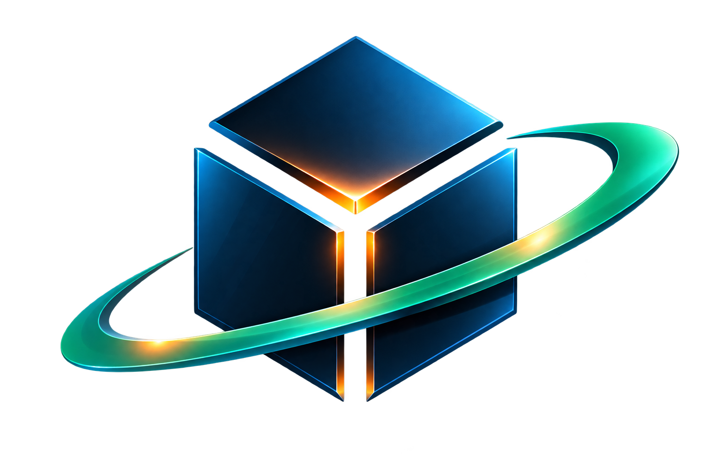
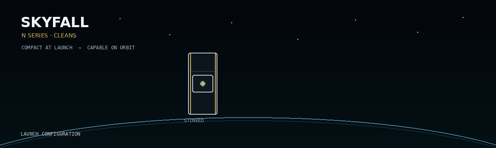

# SKYFALL

<p align="center">
  
</p>

<p align="center">
  <strong>AUTONOMOUS SPACECRAFT · ORBITAL ROBOTICS · ADVANCED SPACE SYSTEMS</strong>
</p>

<p align="center">
  
  
  
  
</p>

---

```text
┌──────────────────────────────────────────────────────────────┐
│                       SKYFALL SYSTEMS                        │
├──────────────────────────────────────────────────────────────┤
│ PROGRAM ................. N SERIES                           │
│ PRIMARY ARCHITECTURE .... CLEANS                             │
│ DOMAIN .................. AUTONOMOUS ORBITAL SYSTEMS         │
│ PLATFORM ................ SMALL SPACECRAFT / MODULAR SYSTEMS │
│ DEVELOPMENT ............. ACTIVE                             │
│ WEB DEPLOYMENT .......... ONLINE                             │
└──────────────────────────────────────────────────────────────┘
```

Skyfall is a U.S.-based space technology effort developing autonomous spacecraft, orbital robotics, proximity-operations technologies, sensing, mission software, and advanced systems for commercial, civil, research, and national-security space missions.

> **Enable spacecraft to perceive, navigate, approach, interact with, and operate around objects in orbit.**

Skyfall builds upon multidisciplinary university research while expanding that work toward a broader family of autonomous spacecraft and orbital systems.

---

# N SERIES

## Compact at Launch. Capable on Orbit.

The **N Series** is Skyfall's developing family of modular spacecraft architectures for autonomous orbital operations.

The program explores spacecraft capable of launching within standardized small-spacecraft envelopes while expanding their functional capabilities after deployment through combinations of spacecraft systems, sensing, communications, autonomy, mobility, deployable systems, and mission-specific payloads.

```text
                         SKYFALL
                            │
                            ▼
                        N SERIES
                            │
              ┌─────────────┼─────────────┐
              │             │             │
              ▼             ▼             ▼
          SMALL FORM     MISSION       EXPANDED
          FACTOR CORE    SYSTEMS       CAPABILITY
              │             │             │
              └─────────────┴─────────────┘
                            │
                            ▼
                 AUTONOMOUS ORBITAL OPS
```

N Series technology areas include:

* Autonomous spacecraft
* Orbital robotics
* Rendezvous and proximity operations
* Orbital inspection
* Space-domain awareness
* Sensing and characterization
* Mission software
* Spacecraft servicing
* Orbital logistics
* Space sustainability

The objective is not a single-purpose spacecraft.

The N Series is intended to provide a common technology foundation from which multiple orbital mission configurations can evolve.

---

# CLEANS

## Initial N Series Mission Architecture

**CLEANS** is the initial mission and technology-development architecture within the Skyfall N Series.

The program traces its origins to multidisciplinary university research focused on the growing challenge of orbital debris and the long-term sustainability of Earth orbit.

The earlier university effort publicly explored a CubeSat-based debris-mitigation concept, mission simulation, digital twins, GNC, spacecraft engineering, mission operations, software, materials, and systems integration.

Today, CLEANS serves as a broader technology-development platform for autonomous orbital operations.

```text
CLEANS
  │
  ├── SENSING
  ├── NAVIGATION
  ├── RENDEZVOUS
  ├── PROXIMITY OPERATIONS
  ├── ORBITAL INTERACTION
  ├── MISSION AUTONOMY
  └── SPACE SUSTAINABILITY
```

---

# UNIVERSITY RESEARCH LINEAGE

<details>
<summary><strong>Expand: CLEANS Academic Origins</strong></summary>

<br>

The original CLEANS project began as a multidisciplinary university spacecraft effort focused on space sustainability and orbital-debris mitigation.

Publicly described areas of work included:

* CubeSat development
* Orbital rendezvous
* Guidance, navigation, and control
* Digital-twin development
* Orbital simulation
* Software engineering
* Materials research
* Mechanical systems
* Mission operations
* Systems engineering
* Business development

The earlier site also described a mission concept involving a small spacecraft, orbital-debris interaction, digital-twin simulation, GNC analysis, and multidisciplinary mission development.

Skyfall represents the continuation and expansion of that foundation into a broader autonomous spacecraft and orbital-robotics effort.

</details>

---

# THE ORBITAL ENVIRONMENT

Earth orbit has become critical infrastructure.

Spacecraft support:

* Global communications
* Navigation and timing
* Weather observation
* Earth observation
* Scientific research
* Human spaceflight
* Commercial services
* Civil infrastructure
* National security

At the same time, inactive spacecraft, spent launch hardware, fragments, and other orbital objects contribute to an increasingly complex operating environment.

Future spacecraft will require increasingly sophisticated capabilities to understand and safely operate within that environment.

---

# MISSION ARCHITECTURE

```text
[01] DETECT
      │
      ▼
[02] CHARACTERIZE
      │
      ▼
[03] NAVIGATE
      │
      ▼
[04] RENDEZVOUS
      │
      ▼
[05] PROXIMITY OPERATIONS
      │
      ▼
[06] INTERACT
      │
      ▼
[07] STABILIZE
      │
      ▼
[08] SERVICE / TRANSFER / DISPOSITION
```

This architecture allows common spacecraft technologies to support multiple potential mission classes.

Rather than treating inspection, servicing, logistics, sustainability, and orbital interaction as completely independent problems, Skyfall explores the common technologies connecting them.

---

# AUTONOMOUS SPACECRAFT

Future spacecraft will increasingly need to understand and respond to their environment without depending exclusively on continuous ground intervention.

Skyfall's technology roadmap therefore emphasizes autonomy throughout the mission lifecycle.

| Capability               | Public Focus                                                            |
| ------------------------ | ----------------------------------------------------------------------- |
| **Sensing**              | Detection, observation, and characterization                            |
| **Navigation**           | Spacecraft-state and relative-motion estimation                         |
| **Rendezvous**           | Controlled orbital approach                                             |
| **Proximity Operations** | Operations near cooperative and non-cooperative objects                 |
| **Interaction**          | Inspection, stabilization, servicing, logistics, and related operations |
| **Mission Autonomy**     | Coordinated software-driven mission execution                           |

---

# ORBITAL ROBOTICS

```text
SENSING
   +
NAVIGATION
   +
AUTONOMY
   +
MOBILITY
   +
ROBOTIC INTERACTION
   +
MISSION SOFTWARE
   │
   ▼
AUTONOMOUS ORBITAL OPERATIONS
```

Skyfall's orbital-robotics work explores technologies that can form the foundation for future inspection, servicing, logistics, sustainability, and other in-space operations.

---

# DIGITAL ENGINEERING

Digital engineering has been part of CLEANS since its university-development phase.

The earlier program incorporated digital-twin concepts, spacecraft simulation, orbital analysis, GNC development, and software-based mission analysis.

Skyfall continues that simulation-driven philosophy.

Public development areas include:

* Orbital mechanics simulation
* Guidance, navigation, and control
* Digital spacecraft models
* Mission simulation
* Software-in-the-loop development
* Hardware-in-the-loop concepts
* Sensor modeling
* Spacecraft-state modeling
* Monte Carlo analysis
* Telemetry
* Mission visualization
* Operational software

---

# N SERIES SYSTEM ARCHITECTURE

```text
                     ┌───────────────────┐
                     │     N SERIES      │
                     │     SPACECRAFT    │
                     └─────────┬─────────┘
                               │
            ┌──────────────────┼──────────────────┐
            │                  │                  │
            ▼                  ▼                  ▼
         SENSING            AUTONOMY          MOBILITY
            │                  │                  │
            └──────────────────┼──────────────────┘
                               │
                               ▼
                     PROXIMITY OPERATIONS
                               │
                               ▼
                      ORBITAL INTERACTION
                               │
                 ┌─────────────┼─────────────┐
                 │             │             │
                 ▼             ▼             ▼
             INSPECTION     SERVICING     LOGISTICS
                 │             │             │
                 └─────────────┼─────────────┘
                               │
                               ▼
                      SPACE SUSTAINABILITY
```

The architecture is intended to support reuse of common spacecraft technologies across multiple mission configurations.

---

# TECHNOLOGY AREAS

| Technology Area                       | Public Focus                                                        |
| ------------------------------------- | ------------------------------------------------------------------- |
| **Autonomous Spacecraft**             | Increasingly independent spacecraft operations                      |
| **Orbital Robotics**                  | Physical operations and interaction in space                        |
| **Rendezvous & Proximity Operations** | Navigation and controlled operation around orbital objects          |
| **Sensing**                           | Detection, observation, characterization, and relative navigation   |
| **Mission Software**                  | Simulation, telemetry, planning, visualization, and flight software |
| **Space Domain Awareness**            | Observation and characterization of the orbital environment         |
| **Orbital Inspection**                | Observation of spacecraft and orbital objects                       |
| **Orbital Servicing**                 | Future spacecraft support and interaction                           |
| **Orbital Logistics**                 | Movement and management of orbital assets                           |
| **Space Sustainability**              | Technologies supporting responsible long-term use of orbit          |

---

# SMALL SPACECRAFT DEVELOPMENT

Current N Series development considers established CubeSat and small-spacecraft engineering practices.

Public reference frameworks include:

* CubeSat Design Specification
* NASA CubeSat development guidance
* NASA Small Spacecraft Systems resources
* CubeSat acceptance processes
* Interface and fit-check practices
* Launch-provider requirements
* Environmental verification standards
* Applicable spacecraft regulatory processes

```text
┌──────────────────────────────────────────┐
│ ENGINEERING CONSIDERATIONS               │
├──────────────────────────────────────────┤
│ MECHANICAL INTERFACES                    │
│ STRUCTURAL INTEGRITY                     │
│ POWER                                    │
│ COMMUNICATIONS                           │
│ GUIDANCE / NAVIGATION / CONTROL          │
│ THERMAL MANAGEMENT                       │
│ DEPLOYABLE SYSTEMS                       │
│ ELECTRICAL SAFETY                        │
│ MATERIALS                                │
│ ENVIRONMENTAL VERIFICATION               │
│ VIBRATION                                │
│ THERMAL VACUUM                           │
│ MISSION ASSURANCE                        │
│ REGULATORY COORDINATION                  │
│ ORBITAL-DEBRIS MITIGATION                │
└──────────────────────────────────────────┘
```

Specific spacecraft configurations and flight requirements depend upon the mission, launch provider, deployment system, regulatory environment, verification program, and applicable mission requirements.

Conceptual material presented publicly by Skyfall should not be interpreted as flight certification or launch-provider approval.

---

# WHO WE SERVE

<details open>
<summary><strong>Commercial Space</strong></summary>

Autonomous spacecraft, mission systems, orbital logistics, servicing, inspection, and emerging in-space operations.

</details>

<details>
<summary><strong>Defense & National Security</strong></summary>

Advanced spacecraft technologies, resilient autonomous systems, sensing, inspection, and orbital mission capabilities.

</details>

<details>
<summary><strong>Civil Space</strong></summary>

Space sustainability, spacecraft technology, scientific missions, inspection, and future servicing architectures.

</details>

<details>
<summary><strong>Satellite Operators</strong></summary>

Inspection, characterization, situational awareness, and future spacecraft-support capabilities.

</details>

<details>
<summary><strong>Research & Universities</strong></summary>

Experimental spacecraft, technology demonstrations, simulation, research, and collaborative technical development.

</details>

<details>
<summary><strong>Orbital Servicing & Logistics</strong></summary>

Technologies supporting future inspection, servicing, movement, and management of orbital assets.

</details>

<details>
<summary><strong>Space Sustainability</strong></summary>

Systems and technologies intended to contribute to the responsible long-term use of the orbital environment.

</details>

<details>
<summary><strong>Space Domain Awareness & On-Orbit Inspection</strong></summary>

Sensing, characterization, observation, relative navigation, and technologies supporting improved understanding of objects operating in Earth orbit.

</details>

---

# DEVELOPMENT PHILOSOPHY

```text
                     SPACECRAFT
                         │
        ┌────────────────┼────────────────┐
        │                │                │
        ▼                ▼                ▼
    HARDWARE          SOFTWARE         OPERATIONS
        │                │                │
        ├── MECH         ├── GNC          ├── MISSION
        ├── ELEC         ├── AUTONOMY     ├── TELEMETRY
        ├── POWER        ├── SIMULATION   ├── CONTROL
        └── SENSORS      └── DATA         └── ANALYSIS
                         │
                         ▼
                  SYSTEMS ENGINEERING
```

Skyfall combines multiple engineering disciplines around the spacecraft mission rather than treating each subsystem as an isolated technology.

---

# PUBLIC DEVELOPMENT BOUNDARY

```text
PUBLIC REPOSITORY
      │
      ├── MISSION OBJECTIVES
      ├── HIGH-LEVEL ARCHITECTURE
      ├── TECHNOLOGY AREAS
      ├── PUBLIC CONCEPTS
      ├── PROGRAM HISTORY
      ├── WEBSITE
      └── DEVELOPMENT INFRASTRUCTURE

SEPARATE ENGINEERING CONFIGURATION
      │
      └── INTERNAL IMPLEMENTATION
```

This repository is intended to communicate the public-facing Skyfall mission, technology areas, web platform, and selected high-level spacecraft concepts.

Detailed engineering implementation is maintained separately from this public web repository.

---

# SYSTEM STATUS

| System               | Status               |
| -------------------- | -------------------- |
| Web Platform         | `ONLINE`             |
| GitHub Pages         | `DEPLOYED`           |
| N Series             | `ACTIVE DEVELOPMENT` |
| CLEANS               | `ACTIVE DEVELOPMENT` |
| Digital Engineering  | `ACTIVE`             |
| Mission Software     | `ACTIVE`             |
| Space Sustainability | `ACTIVE`             |

---

# LIVE WEBSITE

**GitHub Pages Development Deployment**

https://oosanssmithoo.github.io/Skyfall-Web/

---

# REPOSITORY VISUALS

GitHub can display repository-hosted visuals directly inside this README.

### CLEANS Deployment Sequence

```md
<p align="center">
  
</p>
```

No architecture SVG is currently included. Add an architecture image reference only after the corresponding asset exists in `docs/assets/readme/`.

---

```text
══════════════════════════════════════════════════════════════
                    DEVELOPER MAINTENANCE
══════════════════════════════════════════════════════════════
```

# REPOSITORY STRUCTURE

```text
Skyfall-Web/
│
├── .github/
│   └── workflows/
│       └── deploy.yml
│
├── public/
│   ├── brand/
│   │   ├── manifestation.png
│   │   └── ProductionLogo.png
│   ├── images/
│   │   ├── social/
│   │   │   └── social.jpg
│   │   ├── industries/
│   │   │   └── normalized industry imagery
│   │   └── products/n-series/cleans/
│   │       ├── hero/
│   │       ├── concepts/
│   │       └── public/
│   ├── static/
│   │   └── icons.svg
│   ├── robots.txt
│   └── sitemap.xml
│
├── src/
│   ├── components/
│   │   ├── layout/
│   │   ├── hero/
│   │   ├── sections/
│   │   ├── system/
│   │   └── visuals/
│   ├── data/
│   │   └── products/n-series/
│   ├── styles/
│   │   ├── foundations/
│   │   ├── components/
│   │   ├── sections/
│   │   └── responsive.css
│   ├── App.tsx
│   └── main.tsx
│
├── docs/assets/readme/
├── scripts/smoke.mjs
├── AGENTS.md
├── index.html
├── vite.config.ts
├── package.json
└── README.md
```

---

# WEBSITE TECHNOLOGY

```text
React
TypeScript
Vite
HTML5
CSS3
Git
GitHub Actions
GitHub Pages
```

Production deployment is generated as a static Vite application and published through GitHub Actions.

---

# LOCAL DEVELOPMENT

## Requirements

Install a current supported version of **Node.js** and **npm**.

```bash
node --version
npm --version
```

### Windows PowerShell

Some Windows systems may prevent `npm.ps1` from executing because of PowerShell execution-policy settings.

Use:

```powershell
npm.cmd --version
```

---

## Install Dependencies

```bash
npm install
```

PowerShell:

```powershell
npm.cmd install
```

---

## Start Development Server

```bash
npm run dev
```

PowerShell:

```powershell
npm.cmd run dev
```

---

## Production Build

```bash
npm run build
```

PowerShell:

```powershell
npm.cmd run build
```

Vite generates:

```text
dist/
```

Do not manually maintain files inside `dist/`.

---

## Local Validation

```bash
npm run lint
npm run typecheck
npm run smoke
```

The smoke command performs a production build and verifies the built page, generated bundles, and critical public assets without adding a test framework.

---

# GITHUB PAGES DEPLOYMENT

Workflow:

```text
.github/workflows/deploy.yml
```

Pipeline:

```text
SOURCE
  │
  ▼
main
  │
  ▼
GitHub Actions
  │
  ├── Checkout
  ├── Setup Node
  ├── Install dependencies
  ├── TypeScript build
  ├── Vite build
  ├── Upload Pages artifact
  │
  ▼
GitHub Pages
```

---

# VITE BASE PATH

Current GitHub Pages base:

```text
/Skyfall-Web/
```

Configuration:

```ts
import { defineConfig } from 'vite'
import react from '@vitejs/plugin-react'

export default defineConfig({
  plugins: [react()],
  base: '/Skyfall-Web/',
})
```

Public assets referenced from React should respect the configured Vite base path.

```tsx

```

---

# REACT + TYPESCRIPT + VITE

This project uses React, TypeScript, and Vite.

The React integration is provided through:

```text
@vitejs/plugin-react
```

Application entry point:

```text
src/main.tsx
```

Primary application architecture:

```text
src/App.tsx
```

---

## React Compiler

The React Compiler is not currently enabled.

If adopted later, implementation should be evaluated against the active React and Vite configuration.

---

# ESLINT

The repository uses the existing flat ESLint configuration for TypeScript, React Hooks, and Vite React Refresh checks. Run it with `npm run lint`.

---

# MAINTENANCE QUICK REFERENCE

```powershell
npm.cmd install
npm.cmd run dev
npm.cmd run lint
npm.cmd run typecheck
npm.cmd run build
npm.cmd run smoke
```

---

# PROJECT STATUS

```text
┌─────────────────────────────────────────────────┐
│ SKYFALL                                         │
├─────────────────────────────────────────────────┤
│ N SERIES ................. ACTIVE DEVELOPMENT   │
│ CLEANS ................... ACTIVE DEVELOPMENT   │
│ AUTONOMOUS SPACECRAFT .... ACTIVE               │
│ ORBITAL ROBOTICS ......... ACTIVE               │
│ RPO ...................... ACTIVE               │
│ DIGITAL ENGINEERING ...... ACTIVE               │
│ MISSION SOFTWARE ......... ACTIVE               │
│ SPACE SUSTAINABILITY ..... ACTIVE               │
└─────────────────────────────────────────────────┘
```

---

# SKYFALL

### Build for Orbit.

**Autonomous Spacecraft.**
**Orbital Robotics.**
**Advanced Space Systems.**

---

© Skyfall. All rights reserved.
